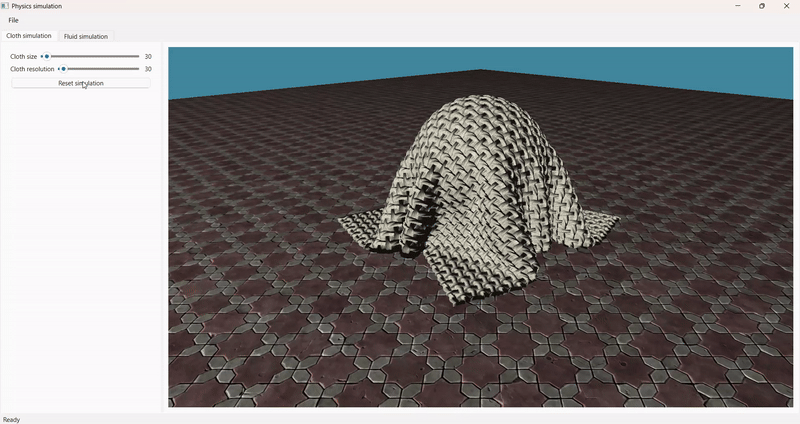
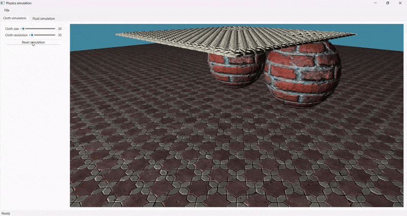

# Physics_Simulation
This is a physics simulator project (C++, Qt, OpenGl)

## Cloth simulation

## Self collision

# Project setup

## On linux, make the scripts executable:
chmod +x scripts/build_release.sh scripts/run.sh scripts/test.sh

## If not already, install vcpkg
### Clone repository
git clone https://github.com/microsoft/vcpkg.git
cd vcpkg
### Build it
#### On windows
.\bootstrap-vcpkg.bat
#### On linux
./bootstrap-vcpkg.sh
## Install GLM using vcpkg
### On windows
.\vcpkg.exe install glm
### On linux
./vcpkg install glm
## Set up the environment variables
CMAKE_TOOLCHAIN_FILE C:\Users\louis\Documents\vcpkg\scripts\buildsystems\vcpkg.cmake
GLM_DIR C:\Users\louis\Documents\vcpkg\installed\x64-windows\share\glm
VCPKG_INCLUDE C:\Users\louis\Documents\vcpkg\installed\x64-windows\include
Restart your IDE

## QT setup
Setup Qt environment variables: 
CMAKE_PREFIX_PATH to (for exemple): C:/Qt/6.8.1/msvc2022_64
QT_QPA_PLATFORM_PLUGIN_PATH to (for example): C:\Qt\6.8.1\msvc2022_64\plugins\platforms
Restart IDE

# cmake
DeployQt.cmake is used to deploy the Qt libraries.